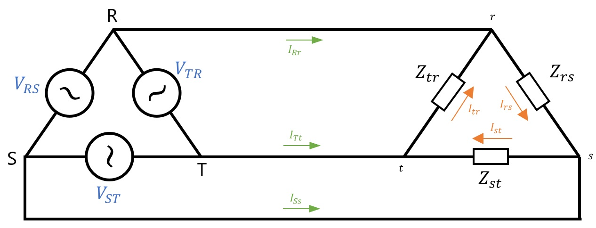

# Sistemas Polifasicos
Los archivos `.m` son funciones utilizadas con MatLab, cada uno tiene su imagen donde se ve la configuraciones de los componentes y los valores que recibe por parámetros. Estos codigos devuelven por consola los datos mas relevantes y grafican los respectivos voltajes, corrientes, potencias y triangulo de potencias final.

 

## Estrella - Estrella (Sin Neutro)
Este algoritmo necesita los valores de las tensiones en cada generador y los valores de cada impedancia.

    

 

## Estrella - Estrella (Con Neutro)
Este algoritmo necesita los valores de tension en cada generador y los valores de cada impedancia.

    

 

## Estrella - Estrella (Con Impedancia en el Neutro)
Este algoritmo necesita los valores de tension en cada generador y los valores de cada impedancia, incluido el de la impedancia entre centros de estrella..

    

 

## Triangulo - Triangulo
Este algoritmo necesita los valores de tension en cada generador y los valores de cada impedancia.

    

 

## Estrella - Triangulo
Este ultimo algoritmo es una extension del anterior ya que recibe los valores de los generadores en estrella y las impedancias en las cargas en triangulo.